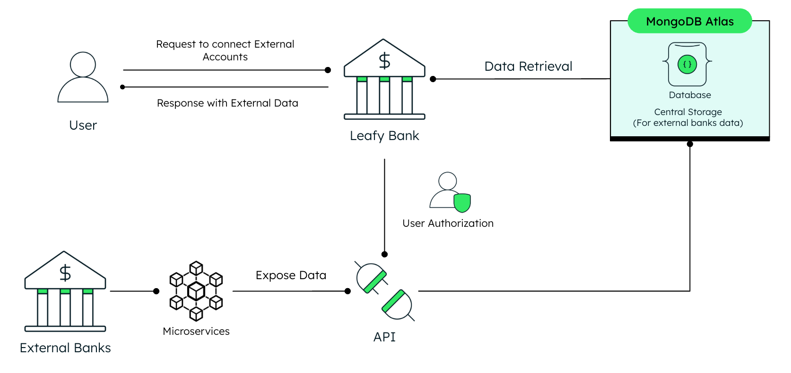

# Leafy Bank UI

**Leafy Bank UI is the graphical user interface (GUI) for our demo banking application**, showcasing the integration of MongoDB's powerful features tailored specifically for [Financial Services](https://www.mongodb.com/solutions/industries/financial-services). This responsive and intuitive UI allows users to interact with a fully functional demo banking environment, highlighting advanced capabilities like real-time data processing, secure financial transactions, and a seamless user experience. It is designed to demonstrate the potential of building modern, customer-focused financial applications with MongoDB as the backbone.

Leafy Bank UI features multiple AI-powered assistants that showcase the incorporation of artificial intelligence in financial services. The **Leafy Personal Assistant** provides quick and accurate answers to questions related to personal banking terms, conditions, and account details. Additionally, specialized **Market Assistant** and **Crypto Assistant** chatbots offer intelligent investment guidance for traditional financial markets and cryptocurrency portfolios respectively, demonstrating how AI can enhance both banking and investment experiences.


## Components and Features:

Leafy Bank UI is composed of several interconnected features that demonstrate the capabilities of modern banking systems. Users can:

1. **Select a Demo User**  
   - Choose from a range of pre-loaded demo users.
   - Each user has unique data such as recent transactions, account information, and banking scenarios.
   - Designed to create a dynamic, realistic experience for the demonstration.

2. **Check User Profile**  
   - View the user's essential information and personal details.

3. **Open New Account**  
   - Showcase the account creation process.
   - Allows demo users to open new banking accounts effortlessly.

4. **View Account Cards and Info**  
   - Display detailed account information, including balances, account numbers, and summaries of opened accounts.

5. **Make Account Transfers or Digital Payments**  
   - Simulate secure financial transactions.
   - Includes account-to-account transfers or payments between predefined demo users.

6. **Query Transaction Details**  
   - Access and inspect the code and document generated for recent transactions.
   - Demonstrates backend integrations and real-time data storage on MongoDB.

7. **Connect with External Institutions**  
   - Simulates connecting to external financial institutions to retrieve data.
   - Users securely authorize the retrieval of external accounts (e.g., savings, checking) and financial products (e.g., loans, mortgages) from third-party financial institutions (e.g. banks).

8. **View Global Financial Summary** 
   - Provides an aggregated view of a user's financial position, including total balances and debts across internal and external accounts and products.

9. **Interact with the Leafy Personal Assistant**  
   - Chat with the AI-powered chatbot.
   - Get contextual, real-time responses related to banking terms, conditions, accounts, or operational FAQs.

10. **Switch Between Demo Users**  
       - Seamlessly switch between pre-selected users.
       - Validate and test how accounts, transactions, and balances behave within the Leafy Bank ecosystem.

11. **Access Investment Portfolios**  
       - Users can access both traditional assets (stocks and ETFs) and cryptocurrency investment portfolios.
       - Get personalized investment guidance through AI-powered Market Assistant for traditional markets and Crypto Assistant for digital assets.
       - Portfolio allocation is predefined for demo purposes, showcasing how intelligent agents can provide insights on diverse investment options.

## Where Does MongoDB Shine?

Leafy Bank UI demonstrates the power and flexibility of MongoDB, making it an ideal choice for financial services applications. By leveraging MongoDB’s advanced features, the backend microservices are designed to handle complex banking operations efficiently and securely. 

This modern **microservices architecture** splits functionalities across different repositories, showcasing a real-world approach to scalable and maintainable software development. Here's how MongoDB shines in the backend services powering Leafy Bank:

### 1. **Accounts Service**
**[Accounts Service Repository](https://github.com/mongodb-industry-solutions/leafy-bank-backend-accounts)**  
This service handles account operations. MongoDB excels here by offering a **flexible schema**, allowing the system to adapt to evolving account data structures without requiring disruptive migrations. Its scalability and adaptability ensure real-time updates and a seamless account management experience.


---

### 2. **Transactions Service**
**[Transactions Service Repository](https://github.com/mongodb-industry-solutions/leafy-bank-backend-transactions)**  
Responsible for handling digital payments and account-to-account transfers, this service uses MongoDB’s **multi-document ACID transactions** to ensure reliable and consistent financial operations. This guarantees the integrity and correctness of data across multiple collections, making MongoDB a trusted choice for critical workflows within banking systems.


---

### 3. **Leafy Personal Assistant Service**
**[Chatbot Service Repository](https://github.com/mongodb-industry-solutions/cross-backend-pdf-rag)**  
This service powers the AI chatbot, which leverages **MongoDB Atlas Vector Search**. Vector search is used to store and query high-dimensional embeddings, enabling the chatbot to retrieve contextually accurate and relevant answers efficiently. MongoDB’s optimized vector search ensures fast and reliable AI-driven interactions within the Leafy Bank ecosystem.


---

### 4. **Open Finance Service**
**[Open Finance Service Repository](https://github.com/mongodb-industry-solutions/leafy-bank-backend-openfinance)**  
This service simulates connecting to external financial institutions to retrieve data. MongoDB’s **flexible schema** and **aggregation pipelines** are used to aggregate and analyze data from multiple sources, providing a comprehensive view of a user’s financial position. MongoDB’s powerful aggregation capabilities, combined with its BSON format, enable seamless integration with external APIs and financial data sources. The **BSON format ensures efficient data storage and processing, while its compatibility with the widely-used JSON format for API communication minimizes the need for serialization or deserialization**.



---

### 5. **Capital Markets - Loaders Service**
**[Capital Markets - Loaders Service Repository](https://github.com/mongodb-industry-solutions/leafy-bank-backend-capitalmarkets-loaders)**
This service handles the extraction, transformation, and loading (ETL) of financial data from various sources, including Yahoo Finance and the Federal Reserve Economic Data (FRED) API, as well as financial news processing from Yahoo Search. It also ingests crypto asset data from the Binance API, social media posts from Reddit, and stablecoin market capitalization data from the CoinGecko API.

MongoDB’s Time Series collections provide optimized storage and efficient querying for market data from Yahoo Finance and Binance, while the flexible document model accommodates financial news articles, Reddit posts, and their corresponding embeddings.


---

### 6. **Capital Markets - Scheduled Agents Service**
**[Capital Markets - Scheduled Agents Service Repository](https://github.com/mongodb-industry-solutions/leafy-bank-backend-capitalmarkets-agents)**
This service delivers automated financial intelligence through scheduled AI-powered workflows that analyze both traditional assets (stocks/ETFs) and digital assets (cryptocurrencies). MongoDB provides the ideal foundation for its agent-based architecture, with the document model aligning perfectly with complex agent state representation in JSON format. 

The service orchestrates six specialized agents organized into three analytical categories:
- **Market Analysis Agents** (Traditional & Crypto): Process time-series data to generate insights on asset trends and market patterns
- **News Analysis Agents** (Traditional & Crypto): Analyze financial news to provide sentiment analysis and market impact assessments
- **Social Media Analysis Agents** (Traditional & Crypto): Extract insights from social media posts to gauge market sentiment and emerging trends

Each agent category runs on a scheduled basis, leveraging MongoDB's vector search capabilities and aggregation framework alongside advanced LLM processing to transform raw market data into actionable intelligence reports.


---

### 7. **Capital Markets - Market Assistant ReAct Agent Chatbot Service**
**[Capital Markets - Market Assistant ReAct Agent Chatbot Service Repository](https://github.com/mongodb-industry-solutions/leafy-bank-backend-capitalmarkets-react-agent-chatbot)**

This service delivers intelligent investment guidance for traditional financial markets through an advanced ReAct (Reason and Act) agent framework. Built with LangGraph, it provides personalized insights on stocks, ETFs, and market trends through a conversational interface.

The Market Assistant leverages MongoDB Atlas to:
- **Maintain conversation memory** through the MongoDB Checkpointer, storing agent state at every interaction step for contextual multi-turn dialogues
- **Access market intelligence** from dedicated collections (reports_market_analysis, reports_market_news, reports_market_sm) generated by the scheduled agents
- **Perform semantic search** using Atlas Vector Search with the finance-optimized Voyage AI (voyage-finance-2) embedding model

The service integrates AWS Bedrock with Anthropic Claude for sophisticated natural language understanding and reasoning capabilities. The agent can analyze complex market queries, provide portfolio recommendations, and deliver actionable insights while maintaining full conversation context across user sessions through its extensible tool architecture.


---

### 8. **Capital Markets - Crypto Assistant ReAct Agent Chatbot Service**
**[Capital Markets - Crypto Assistant ReAct Agent Chatbot Service Repository](https://github.com/mongodb-industry-solutions/leafy-bank-backend-capitalmarkets-react-agent-crypto)**

This service mirrors the Market Assistant's architecture but specializes in cryptocurrency and digital asset intelligence. Built on the same ReAct (Reason and Act) agent framework, it provides personalized crypto investment guidance through an intelligent conversational interface.

The Crypto Assistant leverages MongoDB Atlas to:
- **Maintain conversation memory** through checkpoint collections, enabling contextual multi-turn dialogues about crypto portfolios
- **Access crypto-specific insights** from dedicated collections (reports_crypto_analysis, reports_crypto_news, reports_crypto_sm) generated by the scheduled agents
- **Perform advanced analytics** using MongoDB's aggregation framework and vector search for semantic understanding of crypto market queries

Like its traditional market counterpart, the service integrates AWS Bedrock with Anthropic Claude for natural language processing and uses Voyage AI's embedding model for enhanced semantic search capabilities. The agent can reason through complex crypto queries, access real-time blockchain data, and provide actionable insights while maintaining conversation context across user sessions.


---

### 9. **Capital Markets - MCP Interaction**
**[Capital Markets - Investment Portfolio Management - MCP Interaction Service Repository](https://github.com/mongodb-industry-solutions/leafy-bank-capitalmarkets-mcp)**

This demonstration application showcases the power of MongoDB's Model Context Protocol (MCP) Server integrated with an AI-powered ReAct agent to process predefined financial data queries through an intuitive selection interface. The service exemplifies how modern AI assistants can seamlessly interact with MongoDB Atlas data using standardized protocols.

The MCP implementation leverages MongoDB Atlas to:
- **Enable secure read-only access** to financial data collections (yfinanceMarketData, binanceCryptoData) through a standardized JSON-RPC interface
- **Provide native MongoDB operations** including list, find, and aggregate functions that AI agents can call directly through the MCP protocol
- **Facilitate natural language queries** by allowing the ReAct agent to translate user requests into appropriate MongoDB operations

Built with Next.js and MongoDB's Leafy Green design system, the service integrates AWS Bedrock with Anthropic Claude to interpret user selections and execute corresponding database queries. The MCP Server acts as a secure bridge between the AI agent and MongoDB Atlas, demonstrating how financial institutions can expose their data to AI assistants while maintaining control and observability through the dedicated console interface.


---

By adopting a **microservices architecture**, Leafy Bank splits features across multiple repositories. This design not only supports **scalability**, **modular development**, and **independent deployments** but also underscores MongoDB’s versatility in driving dynamic and robust systems.

Explore the respective backend repositories to learn more about specific implementations and why MongoDB shines in these use cases:
- [Accounts Service](https://github.com/mongodb-industry-solutions/leafy-bank-backend-accounts)
- [Transactions Service](https://github.com/mongodb-industry-solutions/leafy-bank-backend-transactions)
- [Chatbot Service](https://github.com/mongodb-industry-solutions/cross-backend-pdf-rag)
- [Open Finance Service](https://github.com/mongodb-industry-solutions/leafy-bank-backend-openfinance)
- [Capital Markets - Loaders Service](https://github.com/mongodb-industry-solutions/leafy-bank-backend-capitalmarkets-loaders)
- [Capital Markets - Scheduled Agents Service](https://github.com/mongodb-industry-solutions/leafy-bank-backend-capitalmarkets-agents)
- [Capital Markets - Market Assistant ReAct Agent Chatbot Service](https://github.com/mongodb-industry-solutions/leafy-bank-backend-capitalmarkets-react-agent-chatbot)
- [Capital Markets - Crypto Assistant ReAct Agent Chatbot Service](https://github.com/mongodb-industry-solutions/leafy-bank-backend-capitalmarkets-react-agent-crypto)
- [Capital Markets - MCP Interaction](https://github.com/mongodb-industry-solutions/leafy-bank-capitalmarkets-mcp)

This approach reflects a **modern and practical way to develop software**, supporting the scalability, modularity, and maintainability required for financial services in today’s fast-evolving world.


## Tech Stack

Leafy Bank UI is built with a modern tech stack designed to deliver a responsive and dynamic user experience. Here's an overview of the primary technologies used:

- **Database**:  
  - [MongoDB Atlas](https://www.mongodb.com/atlas/database)

- **Web Framework**:  
  - [Next.js](https://nextjs.org/)

- **Styling**:  
  - [CSS Modules](https://github.com/css-modules/css-modules)  
  - [LeafyGreen Design System](https://www.mongodb.design/)

- **UI Components**:  
  - [Leafygreen UI](https://github.com/mongodb/leafygreen-ui) for customizable components  
  - [Bootstrap](https://getbootstrap.com/) and [React Bootstrap](https://react-bootstrap.github.io/) for responsive design

- **Core React and Next.js**:  
  - `next`, `react`, `react-dom`

This tech stack ensures Leafy Bank UI is both powerful and user-friendly, capable of handling the interactive needs of modern financial applications.


## Prerequisites

To run the Leafy Bank UI locally, ensure the following prerequisites are met. 

### Add environment variables

> **_Note:_** Create a `.env.local` file within the `/frontend` directory.

```bash
NEXT_PUBLIC_ACCOUNTS_API_URL="http://localhost:8080"
NEXT_PUBLIC_TRANSACTIONS_API_URL="http://localhost:8001"
NEXT_PUBLIC_CROSS_BACKEND_PDF_RAG_URL="http://localhost:8002"
NEXT_PUBLIC_OPEN_FINANCE_API_URL="http://localhost:8003"
NEXT_PUBLIC_CAPITALMARKETS_LOADERS_API_URL="http://localhost:8004"
NEXT_PUBLIC_CAPITALMARKETS_AGENTS_API_URL="http://localhost:8005"
NEXT_PUBLIC_CAPITALMARKETS_REACT_STOCK_API_URL="http://localhost:8006"
NEXT_PUBLIC_CAPITALMARKETS_REACT_CRYPTO_API_URL="http://localhost:8007"
```

> **_Note:_** The MCP Interaction service operates as a standalone demonstration and doesn't require configuration in the frontend's `.env` file. It runs independently with its own interface and connection settings.

### Backend Services

The UI depends on multiple backend services, which must be running to enable full functionality. It is recommended to configure these services to run on their respective ports, although customization is possible:

- [Accounts Service](https://github.com/mongodb-industry-solutions/leafy-bank-backend-accounts) (Port **8080**)  
  - *Handles account operations and is crucial for displaying account-related functionalities.*  
- [Transactions Service](https://github.com/mongodb-industry-solutions/leafy-bank-backend-transactions) (Port **8001**)  
  - *Manages digital payments and transfers, essential for showcasing transaction-related features.*  
- [Chatbot Service](https://github.com/mongodb-industry-solutions/cross-backend-pdf-rag) (Port **8002**)  
  - *Optional: Needed only if you wish to explore the Leafy Bank Personal Assistant.*
- [Open Finance Service](https://github.com/mongodb-industry-solutions/leafy-bank-backend-openfinance) (Port **8003**)  
  - *Optional: Needed only if you wish to explore external financial institution connections.*
- [Capital Markets - Loaders Service](https://github.com/mongodb-industry-solutions/leafy-bank-backend-capitalmarkets-loaders) (Port **8004**)  
  - *Optional: Needed only if you wish to explore the Capital Markets Loaders Service.*
- [Capital Markets - Scheduled Agents Service](https://github.com/mongodb-industry-solutions/leafy-bank-backend-capitalmarkets-agents) (Port **8005**)  
  - *Optional: Needed only if you wish to explore the Capital Markets Scheduled Agents Service.*
- [Capital Markets - Market Assistant ReAct Agent Chatbot Service](https://github.com/mongodb-industry-solutions/leafy-bank-backend-capitalmarkets-react-agent-chatbot) (Port **8006**)  
  - *Optional: Needed only if you wish to explore the Capital Markets Market Assistant ReAct Agent Chatbot Service.*
- [Capital Markets - Crypto Assistant ReAct Agent Chatbot Service](https://github.com/mongodb-industry-solutions/leafy-bank-backend-capitalmarkets-react-agent-crypto) (Port **8007**)  
  - *Optional: Needed only if you wish to explore the Capital Markets Crypto Assistant ReAct Agent Chatbot Service.*

*The MongoDB database configuration details are provided within each backend service repository.*

These prerequisites are essential for creating a complete and realistic demo environment for Leafy Bank UI. Ensure all services are running and correctly configured to enable smooth interaction across the application.


## Run it Locally

> **Note**: Once you have the backend services running, you can start the Leafy Bank UI locally. Follow these steps to run the UI on your machine:

### Run on Local Machine

1. Navigate to the `/frontend` folder.
2. Install dependencies by running:
```bash
npm install --legacy-peer-deps
```
3. Start the frontend development server with:
````bash
npm run dev
````
4. The frontend will now be accessible at http://localhost:8080 by default, providing a user interface.

## Run with Docker

Make sure to run this on the root directory.

1. To run with Docker use the following command:
```
make build
```
2. To delete the container and image run:
```
make clean
```

## Common errors

- Check that you've created an `.env.local` file that contains the required environment variables.

## 📄 License

See [LICENSE](LICENSE) file for details.
